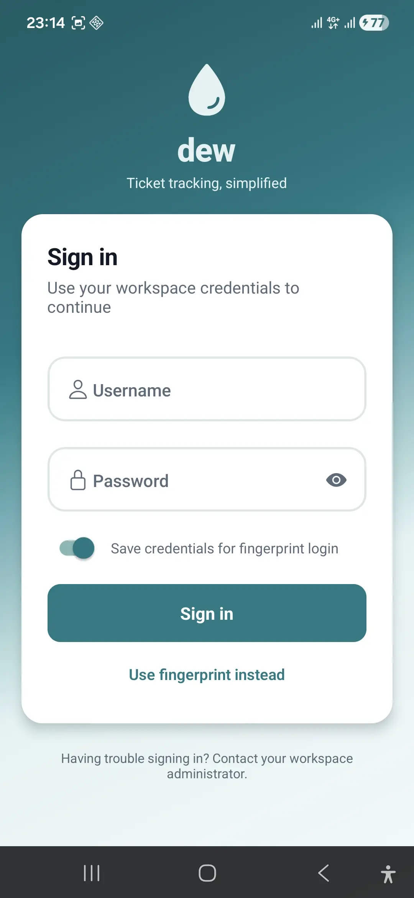
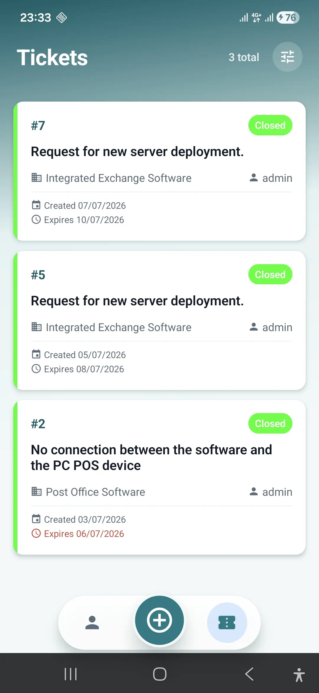
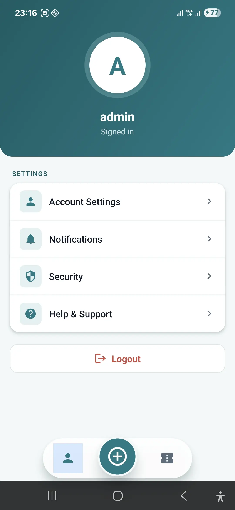

# 💧 Dew Mobile

Dew Mobile is the React Native client for **Dew**, a lightweight ticket/problem-tracking system. It pairs with the [dew-web](https://github.com/jahanbakhsh18/Ticket.Web) backend and lets field/support users create, track, and manage tickets from a phone.

<p align="center">
  
  
  
</p>

## 🧩 Features

- **Ticket creation** with system/problem lookup, description, and multi-file attachments
  (camera, photo library, or document picker)
- **Ticket list & tracking** with search, filtering (status/system), and sorting
- **Ticket detail view** with timeline (created / updated / expired / closed) and attachments
- **Biometric login** (Face ID / fingerprint) backed by secure credential storage
  (`react-native-keychain`)
- **Session cookie + CSRF handling** for a Serenity-style backend, including automatic
  CSRF token refresh

## 🏗️ Tech Stack

| Layer          | Choice                                              |
|----------------|------------------------------------------------------|
| Framework      | React Native 0.85 (New Architecture / Fabric)         |
| Language       | TypeScript                                            |
| Navigation     | React Navigation (native-stack + bottom-tabs)         |
| Networking     | Axios, with cookie + CSRF interceptors                |
| Auth storage   | `react-native-keychain`, `@react-native-async-storage`|
| Biometrics     | `react-native-biometrics`                             |
| File handling  | `@react-native-documents/picker`, `react-native-image-picker` |
| Platforms      | Android / iOS                                         |

## 📁 Project Structure

```
src/
├── components/     # Reusable UI (Dropdown, FloatingLabelInput, CustomTabBar, ...)
├── contexts/        # AuthContext — session, login, dropdown-cache
├── hooks/           # useFileUpload — attachment upload state machine
├── navigation/      # AppNavigator, MainTabNavigator
├── screens/         # LoginScreen, TicketScreen, CreateScreen, ProfileScreen
├── services/        # apiClient, auth.service, ticket.service, file-upload.service
└── types/           # Shared TypeScript types
```

## 🚀 Getting Started

### Prerequisites
- Node.js ≥ 22.11
- npm or yarn
- Android Studio (Android) / Xcode (iOS, macOS only)
- A running instance of the Dew backend (see [dew-web](https://github.com/jahanbakhsh18/Ticket.Web))

### Installation
```bash
git clone https://github.com/jahanbakhsh18/dew-mobile.git
cd dew-mobile
npm install
```

### Configuration
Copy `.env.example` to `.env` and point it at your backend:
```bash
cp .env.example .env
```
```
SERVER_IP=<your backend IP>
DEV_API_PORT=<dev port>
PROD_API_PORT=<prod port>
```

### Running the App
```bash
npm run android
npm run ios
```

## 📄 License

MIT — see [`LICENSE`](LICENSE).
